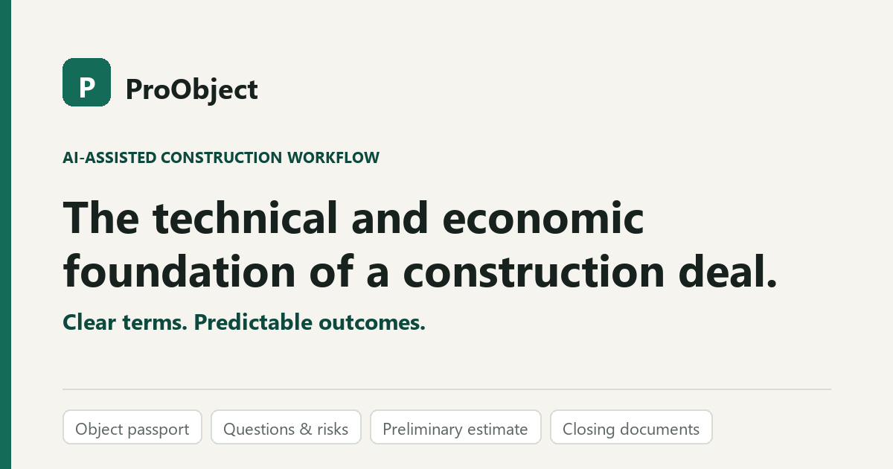

<p align="center">
  
</p>

<h1 align="center">ProObject — public product page</h1>

<p align="center">
  AI-assisted construction workflow: from a request, photo, project, BOQ or defect report<br>
  to a structured task, a defensible preliminary estimate and closing documents.
</p>

---

Static bilingual page (EN / RU). Three files, no build step, no dependencies, no trackers.

It does **not** contain the product. The calculation engine, estimate logic, prompt library
and case database are not published here.

## Structure

```
public/          # everything that is served — and nothing else
  index.html
  styles.css
  script.js      # EN/RU dictionary and language switch
  favicon.svg
  og-cover.png   # link preview, 1200×630
```

## Run locally

```bash
python -m http.server 8765 --directory public
```

## Deploy — Vercel

| Setting | Value |
| --- | --- |
| Framework Preset | Other |
| Build Command | *(empty)* |
| Output Directory | `public` |

After the first deploy, replace the placeholder domain in the `<head>` of
`public/index.html`: `canonical`, `og:url` and both image tags must be absolute URLs, or
link previews break.

## Never commit here

Internal documents · real customer data · keys, seeds, tokens, `.env` · the calculation
core. `.gitignore` and `.vercelignore` enforce this mechanically — still check
`git status` before committing.

## Related

`proobject-xrpl-proof-module` (in preparation) — a public-safe XRPL Testnet proof on
synthetic data only. Documents stay off-chain, no real funds, no token.

## Contact

- **Vitaliy Tolkov** — founder, domain expert — vitalijtolkov487@gmail.com
- **Nikita Tolkov** — core developer — ntolkov06@gmail.com
